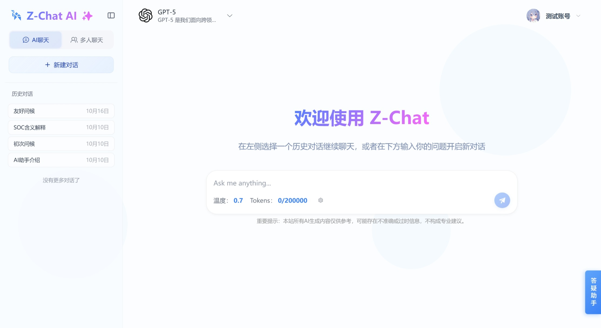
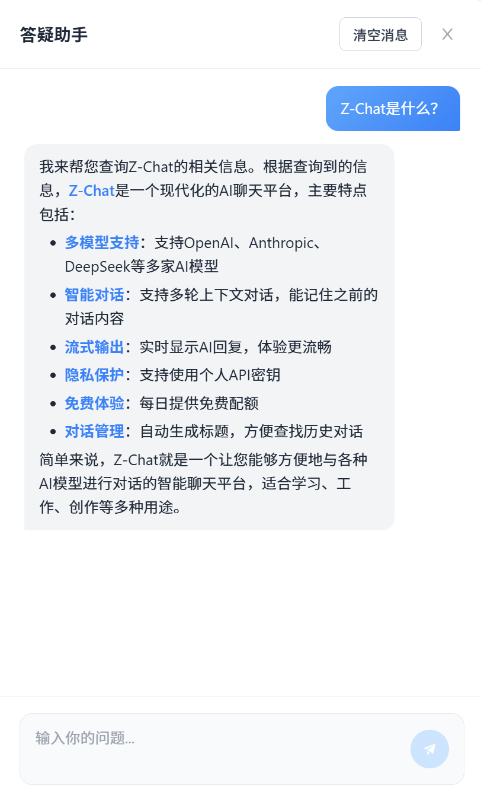

# Z-Chat - AI智能对话平台

<div align="center">

[](https://spring.io/projects/spring-boot)
[](https://www.oracle.com/java/)
[](https://www.mysql.com/)
[](https://redis.io/)
[](https://vuejs.org/)
[](https://www.typescriptlang.org/)
[](https://element-plus.org/)
[](https://baomidou.com/)
[](https://github.com/langchain4j/langchain4j)
[](https://www.docker.com/)
[]()

</div>

> 基于 Spring Boot 3.x + Vue 3 + LangChain4j 的AI对话平台  
> 支持多模型集成、SSE流式响应、用户认证、权限管理

---

## 📖 项目简介

Z-Chat 是一个基于AI的多功能聊天平台，采用前后端分离架构设计，集成了 DeepSeek、GPT 等大语言模型。系统基于 Spring Boot 3.x + Vue 3 构建，实现了完整的AI对话应用。

### 🎯 核心功能

#### 用户系统
- **用户注册登录** - 邮箱验证码注册，支持邮箱/手机号登录
- **JWT认证** - 无状态Token认证，Access Token + Refresh Token机制
- **权限管理** - 基于RBAC的用户权限控制，管理员和普通用户角色
- **个人中心** - 用户信息管理、API Key配置、配额查看

#### AI对话功能
- **多模型支持** - 支持DeepSeek、GPT-4、Claude等多种AI模型动态切换
- **多密钥管理** - 支持用户自定义API Key，根据免费配额自动选择密钥
- **配额系统** - Token计数统计，免费配额扣除，超额后使用用户自己的Key
- **流式响应** - SSE实现打字机效果，实时展示AI生成内容
- **多轮对话** - 从MySQL读取历史消息，手动构建上下文传递给模型
- **会话管理** - 创建、删除、重命名对话，历史记录持久化到数据库
- **内容渲染** - Markdown语法、代码高亮、LaTeX数学公式渲染
- **消息编辑** - 支持编辑历史消息并重新生成回复
- **自动标题** - 根据对话内容自动生成会话标题

#### 网站答疑助手
- **LangChain4j高级API** - 使用AiServices声明式API，自动处理记忆管理
- **内存管理** - InMemoryChatMemoryStore + MessageWindowChatMemory自动维护上下文
- **工具调用** - 集成FAQ查询工具，自动调用获取常见问题答案
- **智能答疑** - 解答网站使用问题，提供操作指导
- **高频问题管理** - 后台管理FAQ，支持增删改查，点击统计

#### 管理后台
- **AI模型管理** - 模型的增删改查、启用/禁用控制
- **系统配置** - 配置答疑助手和标题生成使用的API Key
- **FAQ管理** - 高频问题增删改查、分类管理
- **API Key管理** - 查看和选择管理员的API密钥

#### 文件与邮件
- **头像上传** - 阿里云OSS存储，支持图片格式验证
- **邮件验证码** - 阿里云邮件推送服务，发送注册验证码

#### 安全与限流
- **接口限流** - 基于AOP和Redis的令牌桶算法
- **登录限流** - 防止暴力破解，5分钟最多5次尝试
- **验证码限流** - 1小时最多10次发送

### 💻 技术实现

#### 后端核心
- **前后端分离** - RESTful API + SSE流式通信
- **AI集成方案** - LangChain4j框架，支持OpenAI和Anthropic协议
  - **基础API**：主对话功能使用ChatModel基础API，手动管理历史消息，支持多模型、多密钥、配额扣除等
  - **高级API**：答疑助手使用AiServices + Memory，自动管理上下文，支持工具调用、RAG知识库
- **Spring Boot 3.x** - Spring生态，Java 21
- **Spring Security + JWT** - 认证授权体系，RBAC权限模型
- **MyBatis-Plus + Flyway** - ORM框架 + 数据库版本管理
- **Redis多场景** - 会话管理、接口限流、缓存
- **异步处理** - CompletableFuture + SseEmitter异步流式响应
- **阿里云服务** - OSS对象存储、邮件服务

---

## 🌐 在线体验

**项目地址**: [https://zh8888.top](https://zh8888.top)

**测试账号**:
- 邮箱: `Z-Chat@Outlook.com`
- 密码: `123456`

**或自行注册**: 支持邮箱验证码注册

---

## 📸 项目展示


### 主界面


### 关于我们


### 登录页面


### 注册页面


### 聊天界面



### 答疑助手

<table>
  <tr>
    <td width="50%">
      
      <p align="center"><b>答疑助手</b></p>
    </td>
    <td width="50%">
      
      <p align="center"><b>答疑助手对话</b></p>
    </td>
  </tr>
</table>

### 用户-仪表盘


### 管理后台


---

## 🏗️ 技术架构

```
┌─────────────┐      HTTPS       ┌──────────────────┐
│   Browser   │ ◄──────────────► │      Nginx       │
└─────────────┘                  └──────────────────┘
      │                                    │
      │ EventSource (SSE)                 │
      │ + Axios (REST)                    │
      │                                   │
      └───────────────────────────────────┼─────────────┐
                                          │             │
                                    ┌─────▼─────┐ ┌────▼────┐
                                    │ Vue 3 SPA │ │REST API │
                                    │  + Vite   │ │  + SSE  │
                                    └───────────┘ └────┬────┘
                                                       │
                            ┌──────────────────────────▼──────────────────────┐
                            │         Spring Boot Application                 │
                            │  ┌────────────────────────────────────────────┐ │
                            │  │  Controller (REST API + SSE)               │ │
                            │  ├────────────────────────────────────────────┤ │
                            │  │  Spring Security + JWT Filter              │ │
                            │  ├────────────────────────────────────────────┤ │
                            │  │  Service Layer (业务逻辑)                   │ │
                            │  ├────────────────────────────────────────────┤ │
                            │  │  MyBatis-Plus (DAO层)                      │ │
                            │  └────────────────────────────────────────────┘ │
                            └──────┬──────────────┬────────────┬─────────────┘
                                   │              │            │
                          ┌────────▼────────┐ ┌──▼──────┐ ┌──▼──────────────┐
                          │  MySQL 8.0      │ │ Redis   │ │  LangChain4j    │
                          │  (数据持久化)    │ │ (缓存)  │ │  (AI集成)       │
                          └─────────────────┘ └─────────┘ └──┬──────────────┘
                                                              │
                                                    ┌─────────▼─────────┐
                                                    │   AI模型服务       │
                                                    │  • DeepSeek (API) │
                                                    │  • Claude (API)   │
                                                    │  • GPT-4等        │
                                                    └───────────────────┘
```

---

## 💻 后端技术栈

### 核心框架
| 技术 | 版本 | 说明 |
|------|------|------|
| **Spring Boot** | 3.5.6 | 应用核心框架，提供自动配置和依赖注入 |
| **Java** | 21 | 最新LTS版本，支持虚拟线程等新特性 |
| **Spring Security** | 6.x | 安全框架，提供认证和授权功能 |
| **Spring Web MVC** | 6.x | Web框架，支持SSE流式响应 |
| **Spring AOP** | 6.x | 面向切面编程，用于日志、权限等横切关注点 |

### 数据持久化
| 技术 | 版本 | 说明 |
|------|------|------|
| **MyBatis-Plus** | 3.5.8 | ORM框架，简化CRUD操作，内置分页插件 |
| **MySQL** | 8.0+ | 关系型数据库，主数据存储 |
| **Redis** | 7.x | 内存数据库，用于缓存、会话、限流 |
| **Flyway** | - | 数据库版本管理工具，支持迁移脚本管理 |
| **PageHelper** | 2.1.0 | MyBatis物理分页插件 |

### 认证授权
| 技术 | 版本 | 说明 |
|------|------|------|
| **JWT** | 0.12.3 | JSON Web Token，无状态认证方案 |
| **Spring Security** | 6.x | 基于RBAC的权限控制模型 |
| **Spring Validation** | - | 参数校验框架 |

### AI集成
| 技术 | 版本 | 说明 |
|------|------|------|
| **LangChain4j** | 1.5.0 | Java版LangChain，AI应用开发框架 |
| **LangChain4j-OpenAI** | 1.5.0 | 支持OpenAI协议（DeepSeek、GPT等兼容模型） |
| **LangChain4j-Anthropic** | 1.5.0 | 支持Anthropic协议（Claude模型） |
| **支持模型** | - | DeepSeek、GPT-4、Claude等 |
| **可扩展设计** | - | 通过配置切换模型，支持扩展其他协议 |

### 第三方服务
| 技术 | 版本 | 说明 |
|------|------|------|
| **阿里云OSS SDK** | 3.17.4 | 对象存储服务，文件上传下载 |
| **阿里云邮件服务** | 3.3.1 | SMTP邮件发送，验证码通知 |
| **SpringDoc OpenAPI** | 2.7.0 | API文档自动生成（Swagger 3.0） |

### 工具库
| 技术 | 版本 | 说明 |
|------|------|------|
| **Hutool** | 5.8.40 | Java工具类库，简化常用操作 |
| **Apache Commons Lang3** | 3.18.0 | 常用工具类，字符串、日期等 |
| **Lombok** | - | 减少样板代码，自动生成Getter/Setter |
| **Jackson** | - | JSON序列化/反序列化 |

### 构建工具
| 技术 | 说明 |
|------|------|
| **Maven** | 依赖管理和项目构建 |
| **Spring Boot Maven Plugin** | Spring Boot应用打包插件 |

---

## 🎨 前端技术栈

| 技术 | 版本 | 说明 |
|------|------|------|
| **Vue.js** | 3.5.18 | 渐进式JavaScript框架，Composition API |
| **TypeScript** | 5.8.0 | 类型安全的JavaScript超集 |
| **Vite** | 7.0.6 | 下一代前端构建工具，HMR极速热更新 |
| **Vue Router** | 4.5.1 | 官方路由管理器，支持路由懒加载 |
| **Pinia** | 3.0.3 | Vue 3官方推荐的状态管理库 |
| **Element Plus** | 2.11.3 | 基于Vue 3的企业级UI组件库 |
| **Axios** | 1.12.2 | 基于Promise的HTTP客户端 |
| **Marked** | 16.3.0 | Markdown解析器，支持GFM规范 |
| **Highlight.js** | 11.11.1 | 代码语法高亮库 |
| **KaTeX** | 0.16.23 | 高质量LaTeX数学公式渲染引擎 |
| **DOMPurify** | 3.2.7 | XSS防护，HTML内容过滤 |
| **Day.js** | 1.11.18 | 轻量级日期时间处理库 |
| **Lodash-ES** | 4.17.21 | 模块化的JavaScript工具库 |
| **NProgress** | 0.2.0 | 页面加载进度条 |
| **ESLint + Prettier** | - | 代码格式化和规范检查 |


---

## ⚖️ 版权声明

本项目仅供学习交流，未经授权不得用于商业用途。

---

## 🙏 致谢

感谢以下优秀的开源项目和技术社区：

### 后端框架
- [Spring Boot](https://spring.io/projects/spring-boot) - 强大的Java应用开发框架
- [Spring Security](https://spring.io/projects/spring-security) - 企业级安全框架
- [MyBatis-Plus](https://baomidou.com/) - 优秀的ORM增强工具
- [LangChain4j](https://github.com/langchain4j/langchain4j) - Java版LangChain，AI应用开发利器

### 前端框架
- [Vue.js](https://vuejs.org/) - 渐进式JavaScript框架
- [Element Plus](https://element-plus.org/) - 优雅的Vue 3组件库
- [Vite](https://vitejs.dev/) - 极速的前端构建工具
- [TypeScript](https://www.typescriptlang.org/) - JavaScript的超集，提供类型安全

### 工具库
- [Hutool](https://hutool.cn/) - 强大的Java工具类库
- [Axios](https://axios-http.com/) - 优秀的HTTP客户端
- [Marked](https://marked.js.org/) - Markdown解析器
- [Highlight.js](https://highlightjs.org/) - 代码高亮库
- [KaTeX](https://katex.org/) - 数学公式渲染引擎

### 基础设施
- [MySQL](https://www.mysql.com/) - 世界上最流行的关系型数据库
- [Redis](https://redis.io/) - 高性能的内存数据库
- [Docker](https://www.docker.com/) - 容器化部署解决方案
- [Nginx](https://www.nginx.com/) - 高性能的Web服务器和反向代理

### AI服务
- [DeepSeek](https://www.deepseek.com/) - 优秀的国产大语言模型
- [Anthropic Claude](https://www.anthropic.com/) - 强大的AI助手
- [OpenAI](https://openai.com/) - GPT系列模型

感谢开源社区的无私奉献！

---

<div align="center">


---

<div align="center">

**⭐ 如果这个项目对你有帮助，请给个Star支持一下！**

Made with ❤️ by ZH0531 and Z-Chat Team

</div>

